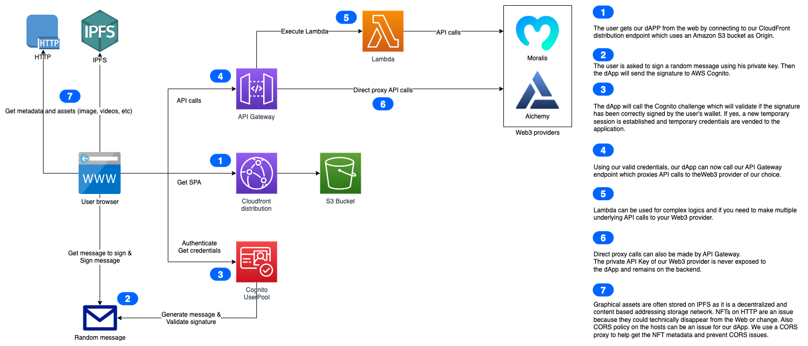

# NFT Gallery

This project allows users to display their NFTs and any NFT collections on Ethereum.

This AWS Blog post explain how this project works in depth: [PUBLIC URL TODO]

# Overview

In this project, we demonstrate how to use various AWS services to authenticate users with their crypto wallet and make secure API calls to [Alchemy](https://www.alchemy.com/) and [Moralis](https://moralis.io/) to get NFT metadata without having to interact directly with the Blockchain.

We show how we can use [Amazon Cognito](https://aws.amazon.com/cognito/) to authenticate users using their crypto wallet so they can obtain an identity and temporary credentials to access AWS services.

We will use an Amazon Cognito custom authentication challenge to ask users to sign a random message with their crypto wallet. Amazon Cognito, by the way of [Lambda Triggers](https://docs.aws.amazon.com/cognito/latest/developerguide/cognito-user-identity-pools-working-with-aws-lambda-triggers.html), will validate if the signature is valid and will issue an ID token which proves that the user's wallet address has signed the given message. 

We also demonstrate multiple ways to authorize access to [API Gateway](https://aws.amazon.com/api-gateway/) routes using this ID Token and [IAM Roles](https://docs.aws.amazon.com/cognito/latest/developerguide/iam-roles.html). API Gateway acts as a proxy to Alchemy and Moralis.

We also showcases the use of Amazon Cognito IdentityPool to support unauthenticated users authorization.

# Architecture 

# Deployment

First go to the `backend` folder, open the README there and deploy the architecture using [SAM](https://aws.amazon.com/serverless/sam/).

Then go to the `dapp` folder, open the README there and run the dApp locally.

# Inspiration

This work was inspired by: https://davbarrick.medium.com/how-to-build-a-serverless-web3-wallet-login-like-opensea-with-metamask-and-cognito-eb93c723f4de
